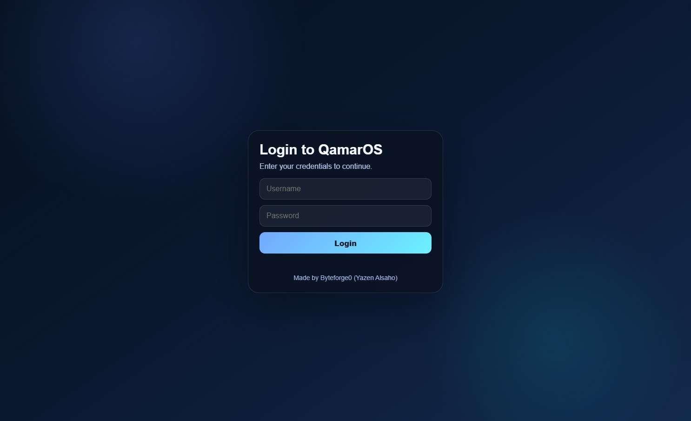
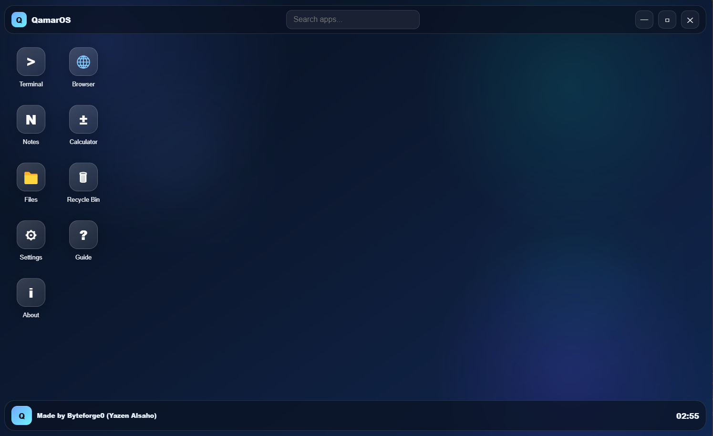
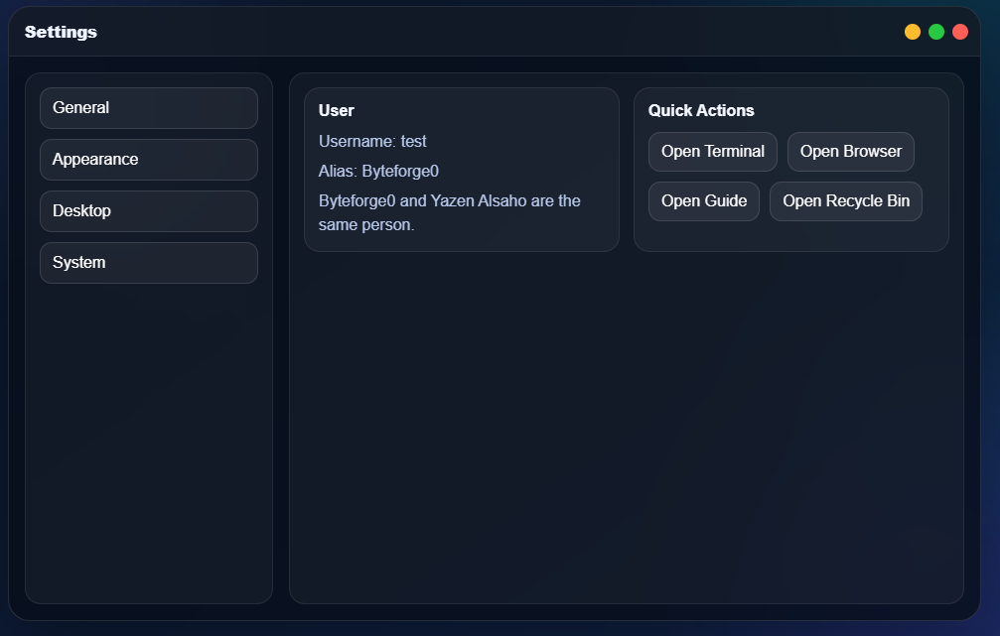
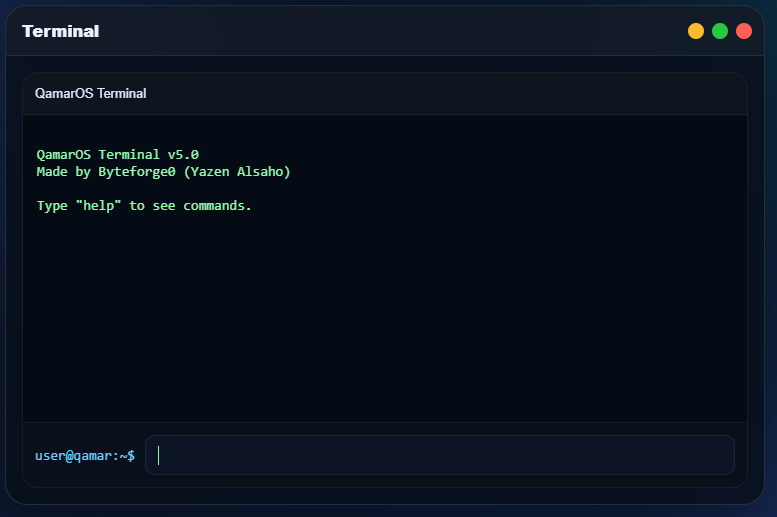

# QamarOS

<p align="center">
  
  
  
  
  
  
</p>

<p align="center">
  <b>QamarOS</b> is a futuristic desktop operating system simulation built with Electron, HTML, CSS, and JavaScript.
</p>

<p align="center">
  A custom desktop environment with a boot screen, first-time setup, login system, taskbar, movable windows, built-in apps, themes, wallpapers, and more.
</p>

---

## Overview

QamarOS is a portfolio project designed to simulate the look and feel of a modern desktop operating system.

It is **not a real hardware-level operating system**. Instead, it is a fully custom **desktop OS concept** running as an Electron application. The goal of this project is to showcase UI design, desktop interaction logic, app window management, and frontend engineering in a polished and branded format.

---

## Creator

**Made by Byteforge0 (Yazen Alsaho)**


---

## ✨ Features

### **Core System**
**Custom Boot Screen**: Animated sequence with boot sound support.

**First-time Setup**: User-friendly onboarding flow.

**Login System**: Persistent local account storage via LocalStorage.

**Search Bar**: Quickly find and launch desktop apps.


### **Desktop UI**
**Futuristic Design**: High-quality glass-style (Glassmorphism) interface.

**Interactive Taskbar**: Dynamic buttons with window state tracking.

**Customization**: Right-click context menus, theme switching, and wallpapers.

**Window Management**: Drag, minimize, maximize, and focus control.


### **Included Apps**
🖥️ **Terminal**: Built-in CLI with commands like help, whoami, theme, and open.

🌐 **Browser**: A webview-powered browser for surfing the web.

📝 **Notes**: Simple text editor with local saving functionality.

🔢 **Calculator**: Basic math operations in a sleek UI.

📁 **Files**: Simulated file explorer.

🗑️ **Recycle Bin**: Manage deleted items.

⚙️ **Settings**: Change themes, wallpapers, and view system info.

---


## Screenshots

<p align="center">
  
</p>

<p align="center">
  
</p>

<p align="center">
  
</p>

<p align="center">
  
</p>


## Installation
1. **Clone the repository**
   ```bash
   git clone [https://github.com/Byteforge0/QamarOS.git](https://github.com/Byteforge0/QamarOS.git)
   cd QamarOS
   
2. **Install dependencies**
   ```bash
   npm install

3. Start the project
   ```bash
   npm start


## 💻 **Tech Stack**
**Framework**: Electron

**Frontend**: HTML5, CSS3, JavaScript (ES6+)

**Persistence**: LocalStorage


## 📄 **License**
This project is licensed under the MIT License.

## 👤 **Creator**
Created by **Byteforge0 (Yazen Alsaho)**.
Feel free to reach out or star the repo if you like the project!
